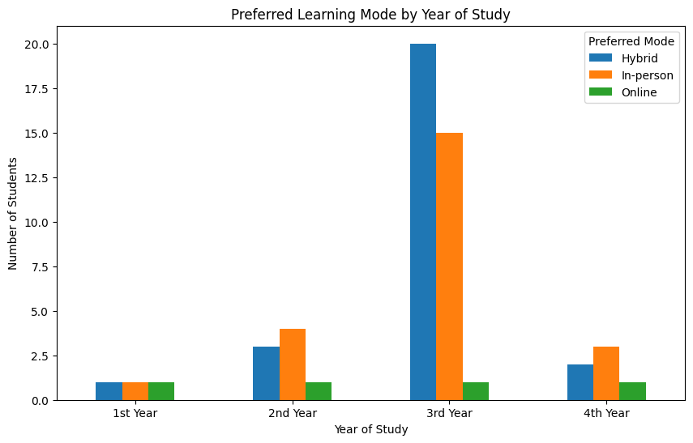

# Statistical Analysis of Student Learning Preferences

  

## 🌟 Project Overview

This project is a complete statistical study designed and executed to answer a critical question in modern education: **"Is there a link between a student's year of study and their preferred learning mode (In-person, Hybrid, or Online)?"**

Developed for my Statistical Inference course, this project showcases the full research lifecycle, from formulating a hypothesis and designing a survey to collecting data, performing statistical tests, and deriving actionable recommendations.

---

## 🚀 Core Features & Technical Journey

This project was executed in four professional phases, demonstrating a comprehensive understanding of the statistical research process.

### 1. Research & Survey Design
The project began by defining a clear research question based on current trends in digital education. A custom survey was then designed in Google Forms to collect the necessary data.
*   **Hypothesis Formulation:** Established a clear Null Hypothesis (H₀) and Alternative Hypothesis (H₁).
*   **Survey Instrument:** Designed a 10-question survey to capture key categorical and continuous variables, including the two core variables needed for the Chi-Square test.
*   **Sampling Strategy:** Employed a convenience sampling method to collect 53 valid responses from the target population of computer science students.

> **[📂 See the full survey design in the `1_Survey_Design` folder.](./1_Survey_Design)**

### 2. Data Preparation & Descriptive Analysis
The raw survey data was imported into a Python environment using the Pandas library. Key preparation steps included:
*   **Data Cleaning:** Standardizing categorical text (e.g., 'In-person (traditional classroom setting)' to 'In-person').
*   **Category Consolidation:** Merging sparse categories to ensure the validity of statistical tests.
*   **Descriptive Statistics:** Calculating frequencies, means, and medians to generate a clear profile of the sample population. The analysis revealed a strong preference for **Hybrid (49.1%)** and **In-person (43.4%)** learning modes.

### 3. Normality & Hypothesis Testing
This phase formed the statistical core of the project, where formal tests were conducted to validate assumptions and answer the research question.
*   **Normality Testing:** Assessed the distribution of the 'Satisfaction_Rating' variable using both visual methods (Histogram, Q-Q Plot) and the formal **Shapiro-Wilk test**. The results (p-value = 0.004) confirmed the data was **not normally distributed**.
*   **Hypothesis Testing:** Performed a **Chi-Square Test of Independence** to test the association between 'Year of Study' and 'Preferred Learning Mode'. The test yielded a **p-value of 0.604**.

> **[💻 Explore the full Python script and test results in the `2_Analysis_&_Code` folder.](./2_Analysis_&_Code)**

### 4. Conclusion & Business Recommendations
The final phase involved interpreting the statistical results and translating them into actionable business insights.
*   **Statistical Conclusion:** Since the p-value (0.604) was much greater than the significance level (α = 0.05), we **failed to reject the Null Hypothesis**. This means there is no statistically significant evidence in this sample to suggest a student's learning preference changes based on their year of study.
*   **Actionable Recommendations:** Despite the main hypothesis not being supported, the descriptive data provided valuable insights. Recommendations included continuing investment in the popular Hybrid model and conducting further qualitative research to improve overall student satisfaction.

> **[📄 Read the full analysis and recommendations in the `3_Documentation` folder.](./3_Documentation)**

---

## 🛠️ Technologies & Skills Demonstrated

*   **Languages:** `Python`
*   **Libraries:** `Pandas`, `Matplotlib`, `Seaborn`, `SciPy.stats`
*   **Statistical Concepts:**
    *   Hypothesis Testing (Null & Alternative)
    *   Chi-Square Test of Independence
    *   Normality Testing (Shapiro-Wilk, Q-Q Plot)
    *   Descriptive Statistics (Mean, Median, Frequency)
*   **Research Skills:**
    *   Survey Design & Implementation (Google Forms)
    *   Sampling Techniques (Convenience Sampling)
    *   Data Cleaning and Preparation
    *   Deriving Actionable Insights from Statistical Results

---

## 👥 The Team

This project was a successful collaboration between:

*   Hessa Khalfan ([@Heskal](https://github.com/Heskal ))
*   Maryam Ali ([@MaryamBinHamdah](https://github.com/MaryamBinHamdah ))
*   Nourah Abdulla Alghfeli ([@NourahAlghfeli](https://github.com/NourahAlghfeli ))

---

## 📜 License

This project is licensed under the MIT License - see the [LICENSE](LICENSE) file for details.
